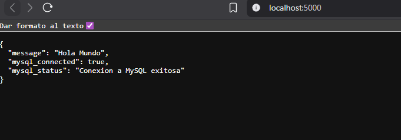

# practica7Electiva

Aplicacion web Hola Mundo con conexion a MySQL usando Docker Compose.

## Estructura

- `src/app.py`: aplicacion Flask
- `src/Dockerfile`: contenedor de la app
- `src/requirements.txt`: dependencias
- `docker-compose.yml`: servicios `app` y `mysql`
- `src/image.png`: imagen solicitada

## Ejecutar

```bash
docker compose up --build
```

Abrir en navegador:

- http://localhost:5000

## Imagen


